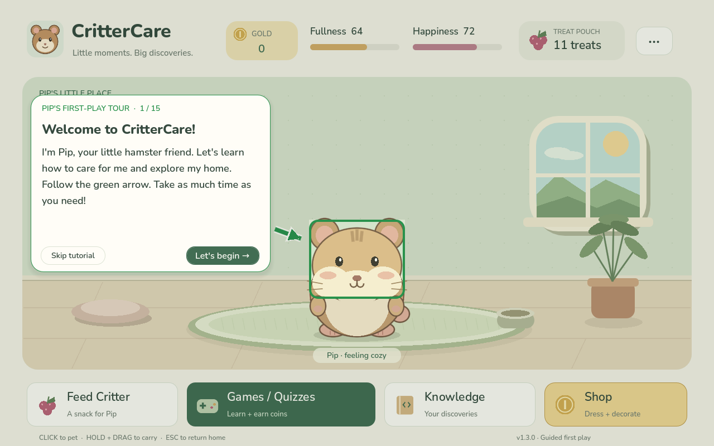
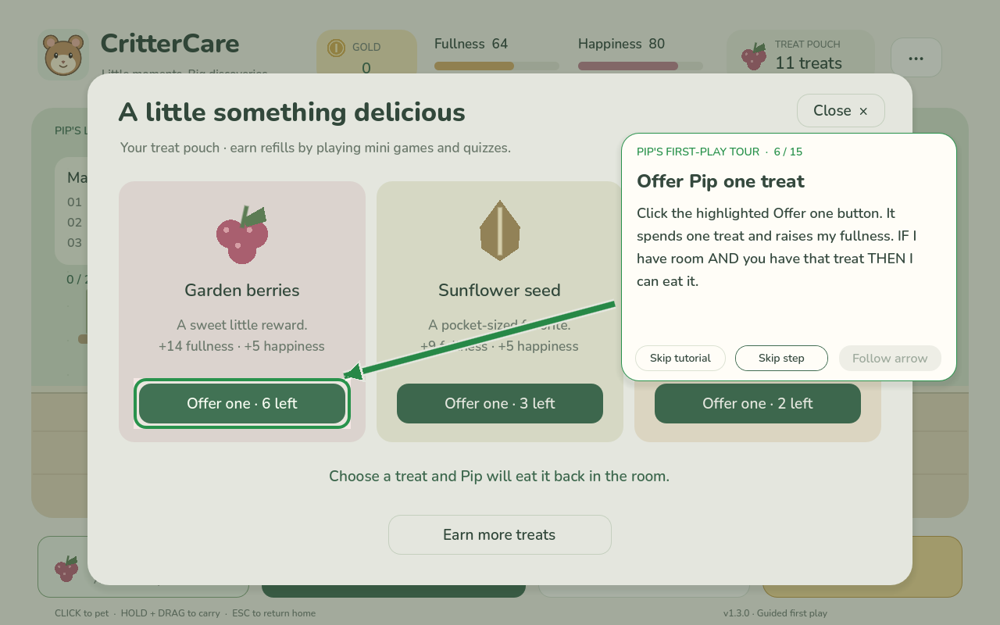
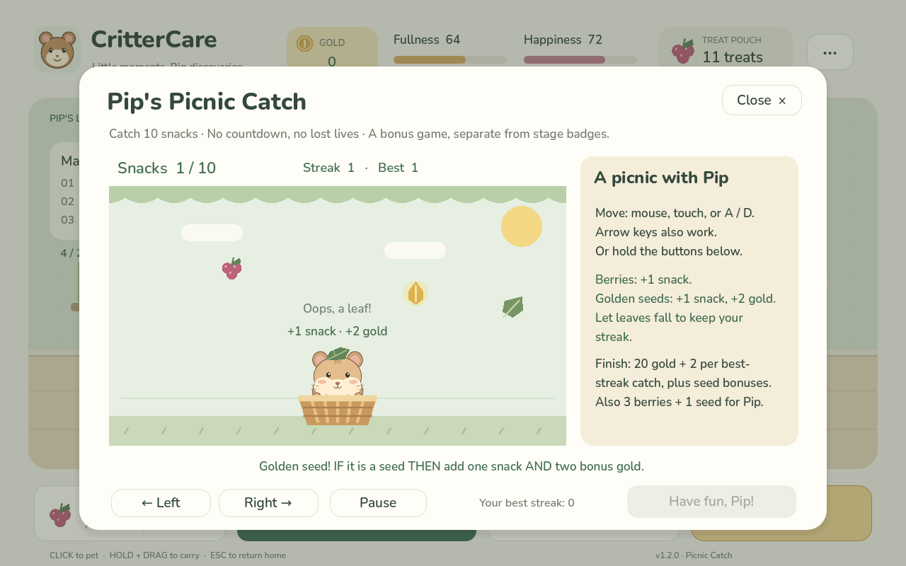

# CritterCare

**Release 1.3.0 · Guided first play**

A complete, offline 2D pet-care game that teaches beginner programming through play. Meet Pip, a little hamster with a lot of curiosity.



## Project abstract

CritterCare is developed with the free, open-source Godot Engine. It uses 2D graphics, GDScript game logic, animated pet interactions, short programming lessons, quizzes and mini-games, pet statistics such as fullness and happiness, menus, HUD elements, a local save system, and a browser export that can be uploaded to itch.io. The game teaches programming by connecting each player action to the logic behind it.

The teaching focus is variables, boolean logic, if-then-else conditionals, loops, and input/output. Pip explains these ideas through interactions: fullness and happiness act as variables, held/not-held state is a boolean, feeding uses conditions, chewing and Loop Garden show repetition, and clicks or button presses demonstrate input and output. The settings menu includes a **Game level** dropdown for **Kindergarten - Elementary level**, **Middle - Highschool**, and **College**, setting how far the learning path can grow. Everyone starts with the same beginner challenges and plain IF/THEN explanations. As players complete activities, higher levels unlock new rules, guided lessons, and more complex applications. No level assumes prior coding knowledge. Players earn coins through completed activities and spend them in a permanent-unlock Shop for pet accessories and room decorations.

## Play immediately

1. **Extract the entire `CritterCare` folder** from the ZIP. Do not run it inside the ZIP preview.
2. Open **Godot 4.7.2**, choose **Import**, and select `CritterCare/project.godot`.
3. Choose **Import & Edit**. Let Godot finish importing the bundled fonts and sounds, then press **F5** (Run Project).

This is a standard GDScript project. You do not need .NET, additional downloads, an account, or an internet connection to play locally. The main scene is already configured. This release targets **Godot 4.7.2**, using the Compatibility renderer. Godot 3 is not supported.

An “older Godot version” message on the previous project described its saved engine version; it did not by itself mean the game was broken. This project now records **4.7**, which is how Godot stores the major/minor project compatibility marker. The bundled Web export templates are specifically **4.7.2**. Import this updated folder instead of the previous download.

On Windows, you can also drag `project.godot` into Godot's Project Manager. Open the complete extracted folder, since the scene needs its `scripts`, `data`, and `assets` folders.

## Confirm you opened the update

The bottom-right footer should say **v1.3.0 · Guided first play**. If it does not, that is an older copy of the game. Extract this download into a fresh folder and import the `project.godot` from that folder rather than launching a previous Project Manager entry. Updating the source folder does not update an already uploaded itch.io game: replace the browser upload with the new **CritterCare-itchio-v1.3.0.zip**, save the itch.io page, and reload it. This release is also supplied with versioned filenames so it is easy to identify the current download. New saves and Reset progress start the guided tour automatically. With an existing save, choose Settings → Replay tutorial to see it without losing progress.

## New: a first-play tutorial



A new save starts a **15-step guided tour**. A **green arrow and outline** point to the real control or part of Pip to use, and short instructions explain what it does. Players pet Pip, hold and drag him, let him land, offer a treat, and read a complete speech lesson. The tour then introduces needs and gold, Knowledge, the pet/room Shop tabs, Game level settings, and Games / Quizzes including Picnic Catch.

The tour waits for the actual action on interaction steps. Informational steps have **Next**; **Skip step** can bypass a difficult gesture. **Skip tutorial** or **Esc** ends the tour. Normal needs do not drain while the tour is open, and other lesson bubbles wait their turn. Green arrow movement stops when Gentler movement is enabled. Mouse/touch guidance and keyboard focus use the same targets; Tab cycles between the highlighted control and tutorial controls.

Completing or skipping the tour saves that choice. It does not repeat on ordinary launches. If you close the game before finishing or skipping, the tour starts from the welcome next time. **Reset progress** clears completion and immediately starts the tour again, while retaining the selected Game level and comfort settings. **Settings → Replay tutorial** starts it without resetting your save. The practice pet/feed actions affect care and inventory normally; no gold or purchases are required. If Pip is full, still chewing, or the pouch is empty during a replay, the feeding step offers a way to continue.

Existing saves from before this release retain their progress and open normally; use Replay tutorial to take the new tour.

## Meet Pip

| Control | What happens |
| --- | --- |
| Short click on Pip's head | Pet him; hearts appear and happiness rises |
| Hold left click anywhere on Pip for about a quarter second | Pick him up |
| Drag while holding | Carry him around; his body sways and his paws dangle |
| Release the mouse | Drop or put him down; gravity, a soft bounce, and a settling animation take over |
| Feed Critter | Choose a berry, seed, or carrot from your inventory |
| Games / Quizzes | Follow the learning path, practice earlier stages, and earn treats and coins |
| Settings → Replay tutorial | Follow the green arrows through the basics again |
| Games / Quizzes → Play Picnic Catch | Move Pip’s basket, catch snacks, and build streaks for gold |
| Shop | Buy, equip, or unequip pet accessories and room decorations |
| Knowledge | Revisit only the lessons you have already encountered |
| Click a learning bubble | Open that discovery in the Knowledge book |
| Next / Back / Done in a bubble | Read every page at your own pace; there is no reading timer |
| Knowledge button in a bubble | Open the full spoken explanation and lesson |
| Read with Pip in Knowledge | Replay the saved explanation in readable pages |
| `P`, `F`, `M`, `K`, `S` | Pet, Feed, Games, Knowledge, Shop keyboard shortcuts |
| `Esc` | Return home from a menu or game |
| `Tab`, `Enter` | Move through and activate UI buttons |

Pip breathes, blinks, looks toward the pointer, washes his face, reacts happily, chews snacks, dangles, leans in all four movement directions, falls, and settles after a landing. The animations are built from vector shapes and damped springs, so there is no sprite-sheet dependency. This is an animated spring-based ragdoll, implemented in GDScript; it does not require a physics-joint rig.

The `···` button opens sound, gentler-movement, game-level, and reset settings. Gentler movement reduces swaying and breathing and removes landing bounce. **Reset progress** asks for confirmation, then clears discoveries, coins, purchases, equipped items, stage badges, scores, picnic records, wins, and care counts. It restores the starter treats and default room/Pip appearance, restarts the tutorial, and keeps comfort settings and the selected game level.

## Care, rewards, and learning

You start with **6 berries, 3 sunflower seeds, and 2 carrot nibbles**. Fullness and happiness gently decrease while the home screen is active. Petting adds 8 happiness, capped at 100. Feeding checks fullness and your inventory before spending a treat. A mini-game win builds appetite by lowering fullness by 12, so you can bring the new snacks back to Pip.

There is no death, no game-over state, no real-money store, and no offline deterioration. Needs and animations pause in menus. A game result can change needs and inventory when you finish it.

| Adventure | How to play | Winning reward |
| --- | --- | --- |
| Berry Detective | Sort 10 finds using `if / else`; the last five also require `AND`. Get at least 7 correct. | 5 berries + 2 seeds |
| Loop Garden | Choose how many times a step repeats. Reach a star in each of 3 gardens. Wrong counts can be corrected and retried. | 4 berries + 3 seeds + 1 carrot |
| Pip's Pop Quiz | Answer up to 5 shuffled questions drawn **only from discovered lessons**. Get at least 60% correct. | 2 berries per correct answer + 1 seed |
| Picnic Catch | Move Pip’s basket to catch 10 snacks. No countdown or lost lives. | 20 gold + streak/seed bonuses; 3 berries + 1 seed |

Quizzes explain mistakes, identify the correct answer, and lock each choice after it is submitted. Treats are awarded for wins. Coins are awarded once per completed activity, including attempts below the winning score. Leaving an unfinished activity grants no rewards. The games menu shows stage badges and your top three winning scores. Loop Garden scores start at 100 and decrease by 5 per extra attempt, with a minimum winning score of 60. Quiz and sorting scores are the percentage of correct answers. Picnic Catch records the best catch streak as a percentage of ten.

**24 authored discoveries** include the original 12 care/game lessons, 11 concepts introduced along the learning path, and a new Picnic Catch input/output lesson. Home bubbles and new guided pages explain ideas in ordinary words before showing code. Quiz pools contain only lessons actually displayed, and later-stage quizzes focus on that stage's concepts. Every Knowledge entry starts with **Pip says**, containing the complete explanation Pip last gave for that lesson. Those words stay saved even if the learner changes game levels. The explanation and code follow in the same scrollable page. Older saves receive a complete fallback quote for discoveries made before dialogue recording was added.

Speech uses a readable fixed font and **Next**, **Back**, and **Done** controls. Long explanations split across pages, with no lost words or automatic timeout. Press Done to let the next queued lesson appear. Mini-game feedback and guided explanations also scroll when needed.

### New: Pip’s Picnic Catch



Choose **Games / Quizzes → Play Picnic Catch**. Pip explains the rules first; nothing falls until you press **Start picnic**. Move the mouse inside the garden, touch/drag, hold the on-screen direction buttons, or use **Left / Right** or **A / D** to move the basket. Your equipped pet accessories come with Pip.

Catch **10 snacks** to finish. There is no countdown or lost life. Missing a snack restarts only the current streak; previously collected snacks and the best streak remain. **Pause / Resume** freezes the round; Space also toggles pause while the garden has keyboard focus. Switching away from the application pauses it automatically. Unfinished rounds are not saved and give no rewards.

Every learner starts with slow berries. At Stage 2, golden seeds join the berries and give two extra gold each. At Stages 3–4, leaves also fall: let them pass, because catching a leaf resets the current streak without taking away snacks or gold. The relevant OR and IF/ELIF/ELSE lessons appear before these rules. Gentler movement keeps the slower falling speed at every stage.

A completed picnic pays **20 + (2 × best streak) + golden-seed bonuses** gold and **3 berries + 1 seed**. It increases Pip’s happiness like other wins. A perfect berry-only picnic gives 40 gold. The personal best and completed-picnic count save automatically and clear with Reset progress. Pip’s full explanation and the last round’s streak are saved under **Catch a snack with Pip** in Knowledge.

This is an optional play break. It does not replace any of the three badges needed to unlock a curriculum stage.

### A learning path that starts easy

| Stage | What changes in gameplay | Available levels |
| --- | --- | --- |
| 1. First steps | Original berry/AND sorting and one-step repeat puzzles; IF/ELSE, booleans, and basic variables | All three levels |
| 2. More ways to decide | OR and NOT sorting; comparisons; loops with a starting value and steps of 2 or 3 | Middle–Highschool and College |
| 3. Little recipes | Three-way IF/ELIF/ELSE sorting; function parameters and running totals | Middle–Highschool and College |
| 4. Code explorer | Grouped food/freshness rules, exact fullness limits, lists starting at index 0, and animated inner/outer loops | College |

Kindergarten–Elementary always stays at Stage 1. Higher levels start there too. Earn a badge in **each of the three activities** to unlock the next stage: win Berry Detective, finish all three Loop Gardens, and win a quiz of **at least three questions**. A one- or two-question quiz still awards normal rewards, but does not satisfy the stage badge. New stages are selected automatically when unlocked; use the stage dropdown to replay any earlier stage. Switching Game level changes the available range without erasing previously earned badges or purchases. Existing saves begin the new path at Stage 1 while retaining their earlier care progress.

### Coins and customization

Each completed curriculum activity awards **12 + floor(score / 10) + 5 × stage index** coins, plus **8 extra coins for a win**. Stage indexes are 0–3. A perfect beginner activity therefore gives 30 coins; even a completed 0% attempt gives 12 practice coins. Coins are earned through play only.

The top **GOLD** display shows only your balance. Open Shop with the **gold Shop button at the bottom right**. **S** also opens it from the home screen. Shop is available immediately, even with zero coins. The Shop has **Pet accessories** and **Room decorations** tabs. Buy an item once, then use its **Equip** and **Unequip** buttons at no further cost. Ownership and the current look save automatically. Equipping another item for the same spot replaces only the active appearance; both items remain owned. Hats, neck accessories, and spectacles combine. Room rugs, wallpaper, lighting, and bunting combine.

| Pet accessory | Coins | Room decoration | Coins |
| --- | ---: | --- | ---: |
| Little leaf hat | 20 | Berry blush rug | 25 |
| Berry bow tie | 35 | Cloud blue rug | 50 |
| Round spectacles | 60 | Peach wallpaper | 60 |
| Cozy blue scarf | 75 | Firefly lantern | 90 |
| Daisy sunhat | 110 | Twilight wallpaper | 120 |
| Starlight crown | 180 | Party bunting | 150 |

Accessories follow Pip's swaying, carrying, and landing motion. Decorations update the actual home room. These are cosmetic purchases and do not change learning requirements or game rewards. Reset progress clears all purchases; ordinary unequipping, switching levels, or reopening the game does not.

GDScript snippets in the book are deliberately simplified teaching examples of the implemented logic. They are not standalone scripts to paste directly into a scene.

## Saved progress

The game automatically saves inventory, needs, discoveries, care counts, wins, local scores, sound, gentler movement, the selected game level, coins, permanent purchases, equipped items, stage badges, the chosen practice stage, picnic best streak and completed rounds, tutorial completion, and the full encountered explanation for each lesson. Saves happen after important actions, every 30 seconds, and on focus loss/close. Live animation poses and unfinished mini-game rounds are not saved; Pip returns to his resting place when the game starts again.

The save is `user://crittercare_save.json`. On Windows, this is normally:

```text
%APPDATA%\Godot\app_userdata\CritterCare\crittercare_save.json
```

To start a fresh classroom demo, use **Settings → Reset progress**. Resetting removes that save's purchases and coins too. A missing or malformed save falls back to a fresh game.

The browser build saves in that browser's storage for the game page. Browser and F5 progress are separate. Private browsing, blocked site storage, or clearing browser data can prevent or remove saved progress; the game still runs if saving is unavailable. Keep the same itch.io project for future uploads to give existing browser saves the best chance of remaining available.

## Project map

| File | Purpose |
| --- | --- |
| `project.godot` | Resolution, renderer, icon, and startup scene |
| `scenes/main.tscn` | Home scene: coordinator, room, Pip, and interface layer |
| `scripts/main.gd` | Home UI, learning bubbles, feeding, mini games, quizzes, and rewards |
| `scripts/hamster.gd` | Mouse input, spring motion, animation states, and hamster vector artwork |
| `scripts/room.gd` | Editable room, window, furniture, mat, plants, and colors |
| `scripts/ui.gd` | Shared UI styles, typography, and layout helpers |
| `scripts/icon.gd` | Original vector icons and mini-game objects |
| `scripts/save_data.gd` | Persistence, needs, inventory validation, and scoring |
| `data/curriculum.gd` | Stage availability, prerequisites, rules, and deterministic sort outcomes |
| `data/shop.gd` | One catalog for prices, ownership validation, categories, and equipment slots |
| `scripts/cosmetic_art.gd` | Shared vector artwork for Shop previews and equipped accessories |
| `data/lessons.gd` | Every lesson, level-specific explanation, quiz question, and feedback style |
| `assets/` | Included fonts, licenses, app icon, and original sound effects |
| `scripts/tutorial.gd` | First-play/reset tour, green arrows, highlighted controls, and keyboard guidance |
| `scripts/picnic.gd` | Picnic Catch movement, falling snacks, collisions, and round state |
| `tests/verify.gd` | Repeatable integration checks |
| `docs/WORKSHOP.md` | A short workshop flow and concept discovery guide |
| `docs/VALIDATION.md` | Tested behaviors and practical limits |
| `docs/ITCH_IO.md` | Browser upload and future export instructions |
| `export_presets.cfg` | Configured single-thread Web export preset |
| `export_templates/4.7.2/` | Bundled official Web templates and engine notices |
| `addons/crittercare_export/` | Enabled editor menu for exporting an itch.io ZIP |
| `tools/web_builder.gd` | Export and ZIP logic shared by the editor menu and CLI |
| `tools/web_shell.html` | Browser loading screen, canvas focus, and error display |
| `builds/CritterCare-itchio.zip` | Ready-to-upload browser build |

The room, Pip, and most controls are drawn or created when the game runs. It is normal for the editor's 2D preview to show only the scene nodes before you press Play. The source is organized and commented so you can change the artwork, lessons, colors, reward amounts, or game rules.

## Play on itch.io

The included **`builds/CritterCare-itchio.zip`** is already exported. A separate copy of that ZIP is also supplied with this release. Upload the browser ZIP to an itch.io **HTML Game** project and mark the upload **This file will be played in the browser**. Choose **Embed in page**, set the viewport to **960 × 600**, and enable the fullscreen button. To start loading as soon as someone opens the page, turn off itch.io's **Click to Play** option. These are settings on your itch.io page, so they cannot be switched on by a downloaded Godot project.

Upload the browser ZIP intact: its `index.html` is at the ZIP root with all required companion files. The game begins at Pip's room after its initial download; no install or player account is required. Sound may wait for a player's first click. See **[docs/ITCH_IO.md](docs/ITCH_IO.md)** for the full checklist and a local browser-preview command.

**Both downloads are built from this single source project. Every future game update must rebuild both the editable project ZIP and the itch.io ZIP.** The export helper always includes the current gameplay, learning content, and Shop data.

After editing the game in **Godot 4.7.2**, choose **Project → Tools → Export CritterCare for itch.io**. The enabled plugin saves open scenes, exports in the background, and rebuilds `builds/CritterCare-itchio.zip`. It uses the official matching Web templates bundled with this project. Local **F5** play continues to work normally and does not require an export.

The **itch.io Web** preset is also available under **Project → Export**. It uses Compatibility rendering, single-thread mode, and the included loading screen. Extensions and PWA are disabled; this build does not require cross-origin isolation headers. If you change Godot versions later, use Web templates matching that version and update the export helper's version guard.

## Optional desktop executable

F5 already runs the game locally through Godot. A standalone Windows, Linux, or macOS executable is a separate optional export: install the matching desktop templates through **Editor → Manage Export Templates**, then add your desktop platform under **Project → Export**. Desktop templates and executables are not included.

## Run the checks

From the project folder, with Godot available as `godot`:

```sh
godot --headless --editor --import --quit --path .
godot --headless --path . --script res://tests/verify.gd -- --test-mode
```

For rendered screenshots and actual pointer tests, run the second command without `--headless`, on a computer with a graphical display. You can add `--capture=/absolute/path/to/screenshots` after `--test-mode`. Always keep `--test-mode` when running the test script: it uses separate temporary save files. The tests do not modify a player's normal save.

To build the itch.io ZIP from the command line, using **Godot 4.7.2**:

```sh
godot --headless --path . --script res://tools/export_web.gd
```

## Credits and references

Code, illustrations, icons, and sound effects are original for this project and provided under the included MIT license. Nunito is distributed under the SIL Open Font License; DejaVu Sans Mono uses its included license. Copies are in `assets/fonts/`.

The bundled Web templates are official Godot 4.7.2 builds. Their MIT license and third-party copyright notices are in `export_templates/4.7.2/`; copies are included in each browser ZIP under `licenses/`.

- [Godot 4.7 command-line documentation](https://docs.godotengine.org/en/4.7/tutorials/editor/command_line_tutorial.html)
- [Godot 4.7 Web export documentation](https://docs.godotengine.org/en/4.7/tutorials/export/exporting_for_web.html)
- [Godot 4.7.2 release download](https://godotengine.org/download/archive/4.7.2-stable/)
- [itch.io HTML5 game documentation](https://itch.io/docs/creators/html5)
- [Nunito font source and license](https://github.com/google/fonts/tree/main/ofl/nunito)
